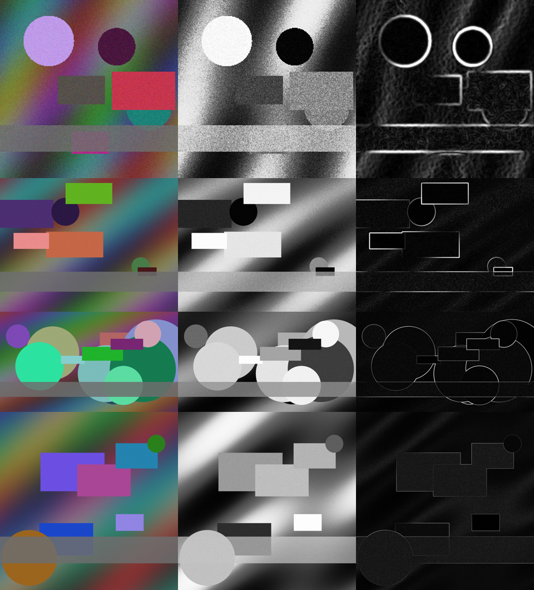

# CUDA Batch Image Enhancement & Edge Detection

**GPU Specialization Capstone Project** - a batch image-processing pipeline
built from **seven hand-written CUDA C++ kernels**. The kernels are compiled at
run time with **NVRTC** and launched through the **CUDA Driver API**, called
directly from Python via `ctypes`. There is no CuPy, PyCUDA or PyTorch layer
in between. Every GPU result is checked pixel-by-pixel against a vectorized
NumPy CPU reference, and the speed-up is measured on 13 images from
0.07 to 16.8 megapixels.



## What it does

For every image in a folder, the pipeline runs:

| # | Stage | Kernel | GPU technique shown |
|---|-------|--------|---------------------|
| 1 | RGB to grayscale (BT.601) | `RgbToGray` | grid-stride loop |
| 2 | 256-bin histogram | `Histogram256` | per-block **shared-memory privatized histogram**, shared + global `atomicAdd` |
| 3 | Equalization LUT from CDF | `BuildEqualizationLut` | single-block **Hillis-Steele parallel scan** in shared memory, `atomicMin` |
| 4 | Apply LUT | `ApplyLut` | LUT staged in shared memory |
| 5 | Gaussian blur, rows | `GaussianBlurRows` | **separable** convolution, shared-memory tile + halo, weights in **`__constant__` memory** |
| 6 | Gaussian blur, columns | `GaussianBlurCols` | **coalesced 2-D tiles** (32x64 + halo), bank-conflict padding, float intermediate |
| 7 | Sobel gradient / edge map | `SobelMagnitude` | **2-D shared-memory tile** with 1-pixel halo, optional binary threshold |

Histogram equalization recovers washed-out, low-contrast regions. The blur
suppresses sensor noise so Sobel doesn't fire on it, and Sobel then outputs
the edge magnitude or a binary edge map. These are the usual preprocessing
steps in front of OCR, medical imaging and computer vision models, which
often have to run over thousands of images.

All kernel source is in [`kernels/image_kernels.cu`](kernels/image_kernels.cu).

## How the GPU is used (architecture)

```
             +-------------------- host (Python) ---------------------+
 PNG/JPG --> | PIL decode -> numpy uint8 HxWx3                        |
             |   cli.py          (argparse CLI, logging, CSV)         |
             |   pipeline.py     GpuPipeline  |  cpu_pipeline (ref)   |
             |   cuda_driver.py  ctypes -> nvcuda.dll / libcuda.so    |
             |                          -> nvrtc64_*.dll / libnvrtc.so|
             +--------------------------|-----------------------------+
                  cuMemcpyHtoD          | cuLaunchKernel x7   cuEventRecord
             +--------------------------v------------ device ---------+
             | rgb -> gray -> hist -> lut -> equalized -> blur_tmp    |
             |      (float) -> blurred -> edges                       |
             +--------------------------|-----------------------------+
                  cuMemcpyDtoH  <-------+
```

1. **Compile:** `image_kernels.cu` is read as text and compiled by NVRTC to
   a **CUBIN** (native SASS) for the detected GPU (`--gpu-architecture=sm_XY`,
   e.g. sm_86 on the RTX 3050 and sm_89 on the lab's L4), then loaded with
   `cuModuleLoadData`. If NVRTC doesn't know that architecture, it falls back
   to PTX, which the driver JIT-compiles.
2. **Allocate once:** device buffers are sized for the largest image seen so
   far and reused across the whole batch, so later images don't pay for
   `cuMemAlloc`.
3. **Launch:** each stage is a `cuLaunchKernel` call, with CUDA events
   recorded between stages so the GPU time of each stage is measured
   (`cuEventElapsedTime`).
4. **Verify:** with `--verify`/`--benchmark`, the same algorithm runs in NumPy
   and the outputs are diffed.

## Requirements and installation

* An NVIDIA GPU and driver. It was developed on an **RTX 3050 Laptop GPU
  (Ampere, sm_86, 4 GB)**, Windows 11, driver 617.14. It also runs in the
  Coursera Linux lab.
* Python 3.9+.
* `pip install -r requirements.txt` installs numpy, pillow, matplotlib and
  `nvidia-cuda-nvrtc-cu12`, the NVRTC compiler. A full CUDA Toolkit is **not**
  required. If one is installed, `$CUDA_PATH` / `/usr/local/cuda` is used
  instead.

```bash
git clone <this repo>
cd gpu-image-pipeline
python -m pip install -r requirements.txt
```

> **Why ctypes instead of CuPy/PyCUDA?** On the development machine, Windows
> *Smart App Control* blocks unsigned native extension modules, including
> CuPy's `_dtype.pyd`. NVIDIA's own DLLs are signed, so talking to the
> Driver API and NVRTC directly works everywhere. It also makes every GPU
> operation in the project explicit, with nothing hidden behind a library.

## Running

One command runs the whole demo: it generates the dataset if needed, runs the
GPU pipeline with CPU verification and benchmarking, runs the tests and
renders the figures.

```bash
./run.sh                           # or: make all
./run.sh --sigma 2.0 --threshold 60   # extra args go to the CLI
```

Running the CLI directly:

```bash
PYTHONPATH=src python -m gpu_pipeline.cli --input data/input --output data/output --benchmark
```

| Flag | Default | Meaning |
|------|---------|---------|
| `-i, --input` | *required* | Folder of images (png/jpg/tif/bmp/ppm/pgm) or a single file |
| `-o, --output` | *required* | Output folder for images, `metrics.csv` and `run.log` |
| `--sigma` | 1.5 | Gaussian sigma; radius = ceil(3*sigma), max 16 |
| `--threshold` | -1 | Sobel threshold; >= 0 gives a binary 0/255 edge map |
| `--outputs` | `equalized,edges` | Which of `gray,equalized,blurred,edges` to save |
| `--verify` | off | Compare against the NumPy reference |
| `--benchmark` | off | `--verify` plus CPU timing and speed-ups |
| `--repeat` | 3 | GPU runs per image; the fastest is reported |
| `--csv`, `--log` | in output dir | Override the metrics / log paths |
| `--device` | 0 | CUDA device ordinal |

Other make targets: `make data` (synthetic images), `make sipi` (download
USC-SIPI test images), `make test`, `make report`, `make build` (NVRTC compile
check only).

## Data

* `data/input/`: 13 reproducible synthetic RGB images
  (`scripts/generate_images.py --seed 7`) from 256x256 up to 4096x4096. Each
  has gradients, shapes, a deliberately washed-out band and Gaussian noise, so
  every stage has visible work to do.
* `scripts/fetch_sipi.py` optionally adds classic images from the
  [USC-SIPI database](https://sipi.usc.edu/database/database.php).

## Proof of execution

All of these are committed:

* [`data/output/run.log`](data/output/run.log): full log of one batch run
  (GPU info, NVRTC compile time, one line per image with GPU/CPU times and
  verification).
* [`data/output/metrics.csv`](data/output/metrics.csv): per-image metrics
  and a per-stage GPU timing breakdown.
* [`data/output/tests.log`](data/output/tests.log): unit-test output.
* `data/output/*_{gray,equalized,blurred,edges}.png`: all outputs.
* `docs/figures/`: charts generated from the CSV.

RESULTS_PLACEHOLDER

## Lessons learned

1. **Memory access pattern matters more than arithmetic.** My first column
   blur was a copy of the row blur turned sideways, with one block per
   column. On the RTX 3050 it took **3.63 ms** on a 4096x4096 image, against
   0.95 ms for the row pass, because each warp read 32 vertically adjacent
   pixels in 32 separate memory transactions. Re-tiling it as 32-wide x
   64-tall blocks, so that `threadIdx.x` walks along a row, made every warp
   load one coalesced transaction. It now takes **0.58 ms (6.2x faster)** and
   total kernel time halved, from 6.9 to 3.8 ms. The FLOPs are identical; only
   the memory access pattern changed.
2. **PCIe transfers dominate end-to-end time.** On the largest image the
   kernels take about 4 ms, but the host-to-device and device-to-host copies
   take about 38 ms, roughly 85-90% of the GPU path. The GPU is still about
   40x faster than the CPU end-to-end and over 250x kernel-to-kernel, but the
   next optimization has to target transfers (pinned memory, streams,
   copying back only the outputs you need), not kernels.
3. **Small images don't pay off as much.** At 256x256 the whole pipeline runs
   in about 0.15 ms of kernel time, and launch overhead plus copies cap the
   speed-up at about 7x. It climbs past 50x from about 2 MP upwards. A real
   batch system would pack small images together.
4. **Floating-point errors get amplified along a pipeline.** The first
   verification run failed: about 0.05% of pixels differed by up to
   **10 gray levels**. The cause was the grayscale conversion. With
   `--use_fast_math` the GPU fuses multiply-adds (FMA), so a value like
   127.4999 rounded to 127 on one side and 128 on the other. That 1-level
   difference moved a pixel into the neighbouring histogram bin. In the
   washed-out band, equalization maps neighbouring bins about 10 levels
   apart. Switching grayscale to 8.8 fixed point, `(77R + 150G + 29B + 128)
   >> 8`, and the LUT to exact 64-bit integer math made those stages
   **bit-exact**. The remaining differences are 1-level rounding in the float
   blur, which Sobel can amplify to at most 4 levels (its kernel weights sum
   to 4). That is why the tolerances are `gray 0, equalized 0, blurred 1,
   edges 4`.
5. **PTX vs CUBIN and driver compatibility.** In the Coursera lab the first
   run failed with `CUDA_ERROR_UNSUPPORTED_PTX_VERSION` (222). NVRTC 12.9 from
   pip emits PTX that the lab's CUDA 12.6 driver can't JIT. Compiling
   straight to SASS (`sm_89`) fixes it, because CUDA *minor-version
   compatibility* covers CUBINs across all 12.x drivers but does not cover
   newer PTX.
6. **Going below the convenience libraries.** Windows Smart App Control
   blocked CuPy's unsigned extension DLL, so I wrote my own ~250-line
   `ctypes` layer over the Driver API and NVRTC. This taught me what a CUDA
   runtime `<<<grid, block>>>` launch actually does underneath: contexts,
   modules, `void**` parameter arrays, `__constant__` symbols through
   `cuModuleGetGlobal`, and events for timing.

## Next steps

* **Overlap copies and compute** with pinned host memory
  (`cuMemAllocHost`) and several CUDA streams, so image *i+1* uploads while
  image *i* is processed. The stage breakdown shows PCIe transfers are the
  largest cost.
* **Fuse kernels:** gray + histogram in one pass, and the column blur + Sobel
  sharing one shared-memory tile. That would cut global-memory round trips
  from 7 to about 3.
* **Register blocking / `float4` loads** in the row blur, which is now the
  slower of the two blur passes.
* **GPU image decode** with nvJPEG, since PNG/JPEG decoding on the CPU now
  dominates batch wall time.
* Add **Canny** (non-maximum suppression plus hysteresis with a GPU
  work-queue), which is the natural next step after Sobel.

## Repository layout

```
kernels/image_kernels.cu     CUDA C++ kernels (the GPU code)
src/gpu_pipeline/cuda_driver.py  ctypes bindings: Driver API + NVRTC
src/gpu_pipeline/pipeline.py     GpuPipeline + NumPy reference
src/gpu_pipeline/cli.py          command-line interface
scripts/                     dataset generation, SIPI download, figures
tests/test_pipeline.py       GPU-vs-CPU unit tests
run.sh, Makefile             build/run support
data/input, data/output      input images and proof-of-execution artifacts
docs/                        figures and presentation outline
```

Style: the CUDA code follows the Google C++ Style Guide (CamelCase function
names, 2-space indent, 80 columns, a comment on every kernel). Tile sizes are
macros so the host code can mirror them. The Python follows the Google
Python Style Guide and is formatted with `yapf --style=google`.
